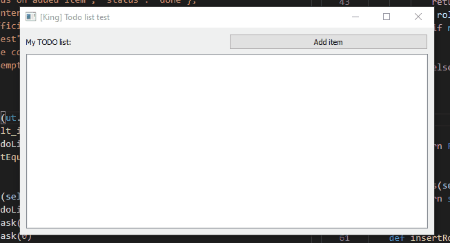

# Tool 1: TODO list

This tool has to allow you to add items with text to a list.
This is the main functionalities that would be expected:
- Add items with text to the list
- Remove items from the list
- Change the status of an item from “not done” to “done” (and the other way round)
- Edit the text of an item
- State persistence so that when the tool is closed and opened, the items are still there



# How to execute?
````python
pytest
python3 todo/main.py
````

# Improvement
- More efficient state persistence: only update the last updated task instead of saving every tasks
- For very large todolist, asynchronous persistence & view rendering can be an option but I don't know if it is a feature supported by Qt